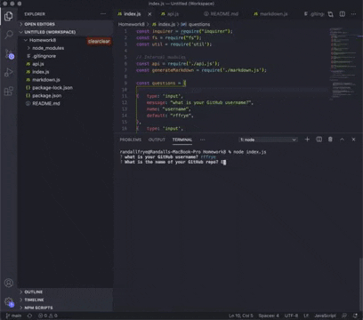

# Homework 8
## Good README Generator

#### Description
In this project node.js was used to create a terminal application that would generate a good README file through a series of questions that the user could input or select answers.  

#### Technologies

* node.js including FS
* ES6
* npm inquirer
* Markdown

#### Demonstration 

#### links

* GitHub: https://github.com/rffrye/Homework8
* Demo Video: https://youtu.be/3PomwYUmfEk

#### Contact

* GitHub Profile: rffrye
